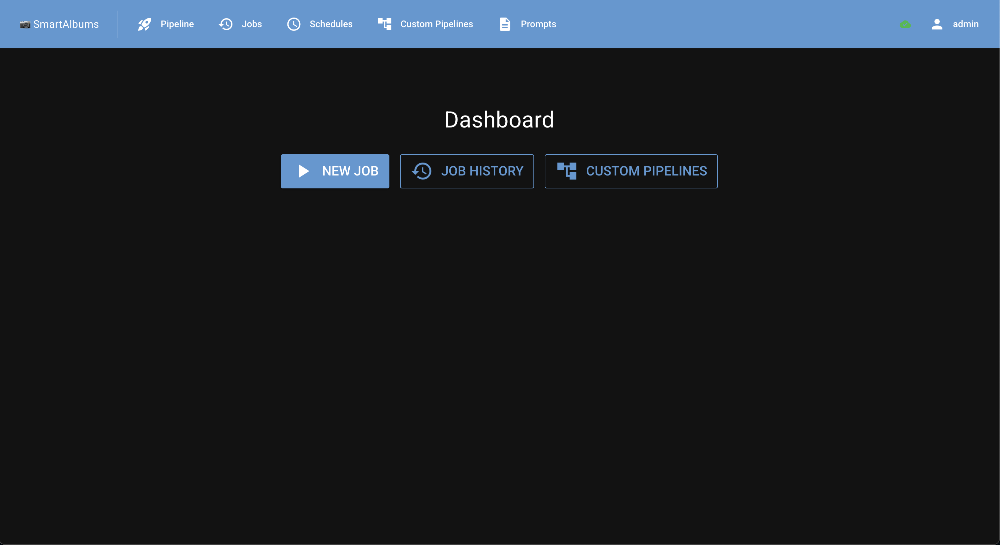
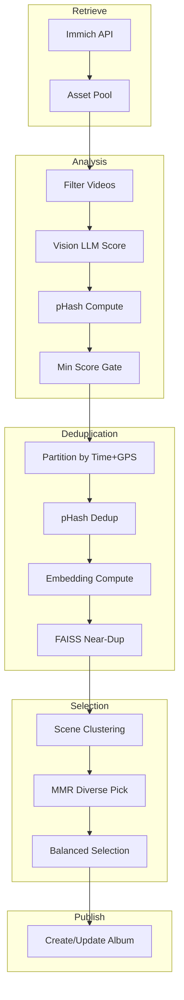

# smart-albums

A CLI tool and web interface that creates curated photo albums in [Immich](https://immich.app/) using AI-powered quality scoring, perceptual duplicate detection, embedding-based scene clustering, and temporal balancing.

## Features

- **Best of Year** — Automatically selects the best photos from a calendar year into a curated album
- **Rotation** — Nightly photo-frame album updates with freshness cooldown and temporal balance
- **Web GUI** — Browser-based interface for configuring pipelines, managing jobs, and monitoring progress
- **Multiple AI backends** — Ollama, llama.cpp, OpenAI-compatible APIs for vision scoring; HuggingFace or Ollama for embeddings
- **Smart deduplication** — Perceptual hashing + FAISS embedding similarity to eliminate near-duplicates
- **Scene clustering** — Groups visually similar photos and picks diverse representatives via MMR
- **Cached analysis** — Scores and embeddings persist locally so re-runs skip already-processed assets

## Quick Start

### Docker (Web GUI)

The easiest way to run smart-albums is with the web interface:

```bash
docker compose -f docker-compose.webgui.yml up -d
```

Then open `http://localhost:8080` in your browser. On first launch you'll create an admin account and configure your providers (Immich, Ollama/llama.cpp, embeddings) through the settings page.

### Docker (CLI only)

For scheduled one-shot runs (e.g. nightly rotation via cron):

```bash
docker build -t smart-albums .
docker run --rm \
  -v /path/to/config:/config \
  smart-albums rotation --config /config/rotation.yaml
```

### Local Installation

```bash
pip install -e ".[dev]"

# With web GUI support:
pip install -e ".[dev,webgui]"

# With HuggingFace local embeddings:
pip install -e ".[huggingface]"
```

## Web GUI

The web GUI provides a full-featured interface for managing smart-albums without touching config files or the command line.



### Running locally

```bash
python -m webgui
```

Opens at `http://localhost:8000` by default (port `8000` inside the container, mapped to `8080` on the host in the Docker Compose example).

### Pages

| Page | Description |
|------|-------------|
| **Pipeline** | Schema-driven form to configure and launch pipeline runs |
| **Jobs** | Monitor running jobs with live progress, view history, cancel/delete |
| **Prompts** | Create and edit scoring prompt files (Markdown) |
| **Settings** | Configure providers (Immich, LLM, embedding, cache) with connection testing |
| **Account** | Change password |

### Environment variables

| Variable | Default | Description |
|----------|---------|-------------|
| `CONFIG_PATH` | `/config/config.yaml` | Path to the YAML config file |
| `STORAGE_SECRET` | (random) | NiceGUI session encryption key. Set for persistent sessions across restarts |
| `ADMIN_USERNAME` | — | Auto-create admin account on first startup |
| `ADMIN_PASSWORD` | — | Password for auto-created admin |
| `HOST` | `0.0.0.0` | Bind address |
| `PORT` | `8000` | Bind port |
| `DEV` | — | Set to `1` or `true` to enable hot-reload |

### Docker deployment

```yaml
# docker-compose.webgui.yml
services:
  smart-albums:
    build:
      context: .
      dockerfile: Dockerfile.webgui
    ports:
      - "8080:8000"
    volumes:
      - ./config.yaml:/config/config.yaml:ro
      - smart-albums-cache:/data/cache
      - smart-albums-prompts:/data/prompts
      - smart-albums-db:/data/db
    environment:
      - STORAGE_SECRET=your-secret-here
```

## CLI Usage

```bash
smart-albums best-of-year --config config.json
smart-albums rotation --config rotation.yaml
```

Copy `config.example.json` and fill in your settings:

```json
{
  "image": "immich",
  "image.immich.base_url": "http://localhost:2283/api",
  "image.immich.api_key": "your-api-key-here",
  "llm": "ollama",
  "llm.ollama.base_url": "http://localhost:11434",
  "llm.ollama.vision_model": "llava:latest",
  "embedding": "huggingface",
  "embedding.huggingface.model_name": "openai/clip-vit-base-patch32",
  "embedding.huggingface.device": "auto",
  "cachemanager": "cache",
  "cachemanager.cache.cache_dir": ".cache",
  "pipeline_settings": {
    "retrieve": { "year": 2025 },
    "score": { "prompt_file": "prompts/best_of_album_curation_guidelines.md" },
    "output.branches.curation.balanced": { "min_photos": 300, "max_photos": 500 },
    "output.branches.curation.publish": { "name": "Best of 2025", "dry_run": true }
  }
}
```

## How it works

### Architecture



The pipeline is a declarative DAG of composable nodes:

```
retrieve → filter → score → phash → min_score
    → partition (time+GPS)
        → pHash dedup → select best → merge
        → compute embeddings
        → near-dup (FAISS) → select best → merge
    → merge
    → partition (time scenes)
        → cosine clustering → diverse pick → merge
    → merge
    → fork
        ├─ curation: balanced select → publish album
        └─ remainder: publish album
```

### Pipeline stages

1. **Retrieve** — Fetches all photo assets from Immich for a configured calendar year.
2. **Filter** — Removes non-image assets (videos, etc.).
3. **Score** — Sends each thumbnail to a vision LLM for aesthetic quality scoring.
4. **pHash** — Computes a 64-bit perceptual hash for duplicate detection.
5. **Min Score Filter** — Removes assets below a configurable quality threshold.
6. **Partition (time + GPS)** — Groups temporally and spatially close photos into event clusters.
7. **pHash Dedup** — Within each event, groups exact/near-exact duplicates by Hamming distance.
8. **Select Best** — Picks the best representative from each duplicate group (sharpness + LLM score).
9. **Embeddings** — Computes visual embeddings for near-duplicate and scene detection.
10. **Near-Duplicate Detection** — Groups visually similar images using FAISS cosine similarity.
11. **Scene Clustering** — Re-partitions by time, then groups by cosine similarity.
12. **Diverse Pick** — Selects diverse representatives using Maximal Marginal Relevance.
13. **Balanced Selection** — Two-phase: monthly quota fill, then quality top-up.
14. **Publish** — Creates/updates albums in Immich.

## Configuration Reference

### Client settings

| Key | Description |
|-----|-------------|
| `image.immich.base_url` | Immich API base URL |
| `image.immich.api_key` | Immich API key |
| `llm.ollama.base_url` | Ollama server URL |
| `llm.ollama.vision_model` | Vision model for scoring |
| `llm.llamacpp.base_url` | llama.cpp server URL |
| `llm.llamacpp.vision_model` | Vision model name |
| `embedding.huggingface.model_name` | HuggingFace model ID for embeddings |
| `embedding.huggingface.device` | Device: `auto`, `cpu`, or `cuda` |
| `cachemanager.cache.cache_dir` | Directory for cached results |

### Pipeline settings

| Key | Default | Description |
|-----|---------|-------------|
| `retrieve.year` | — | Calendar year to process (required) |
| `score.prompt_file` | — | Path to the scoring prompt file |
| `score.concurrency` | `4` | Concurrent LLM scoring requests |
| `min_score.threshold` | `0.0` | Minimum score to retain |
| `events.time_window_minutes` | `5.0` | Max gap within a time cluster |
| `events.gps_window_meters` | `100.0` | Max GPS distance to an anchor |
| `duplicate.threshold` | `0.90` | pHash similarity threshold |
| `near_duplicate.threshold` | `0.95` | Cosine similarity for near-dup grouping |
| `scene_cluster.threshold` | `0.85` | Cosine similarity for scene grouping |
| `balanced.min_photos` | `300` | Target minimum album size |
| `balanced.max_photos` | `500` | Hard maximum album size |
| `publish.name` | — | Album name (required) |
| `publish.dry_run` | `false` | Preview without creating album |

Pipeline settings within fork branches are prefixed with `output.branches.<branch_name>.` (e.g. `output.branches.curation.balanced`).

## Requirements

- Python 3.11+
- A running [Immich](https://immich.app/) server with an API key
- A vision LLM backend: [Ollama](https://ollama.com/), llama.cpp, or OpenAI-compatible
- An embedding backend: HuggingFace (local GPU), Ollama, or a remote embedding service

## Immich API Permissions

| Permission | Purpose |
|------------|---------|
| `assets.read` | Search and retrieve asset metadata |
| `assets.download` | Download thumbnails for pHash/embedding |
| `albums.read` | List albums for conflict detection |
| `albums.create` | Create new albums |
| `server.read` | Validate connectivity |

## Development

```bash
pip install -e ".[dev,webgui]"
pytest              # run all tests
pytest -v           # verbose
pytest tests/test_partition_time.py  # single file
python -m webgui    # run web GUI locally
```

## License

MIT
